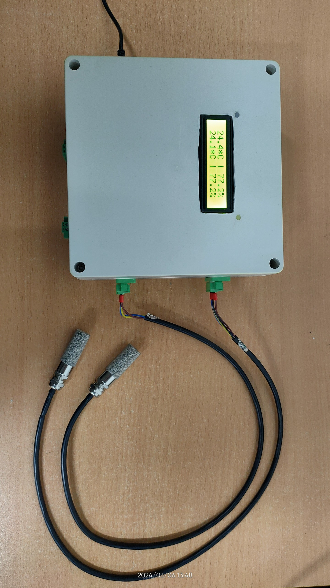

# Measure-Temperature-and-humidity-in-electrical-cabinet
Firmware for temperature and humidity measuring device in electrical cabinet. Base on AirSENSE hardware and ESP-IDF framework and SHT3x sensor.

